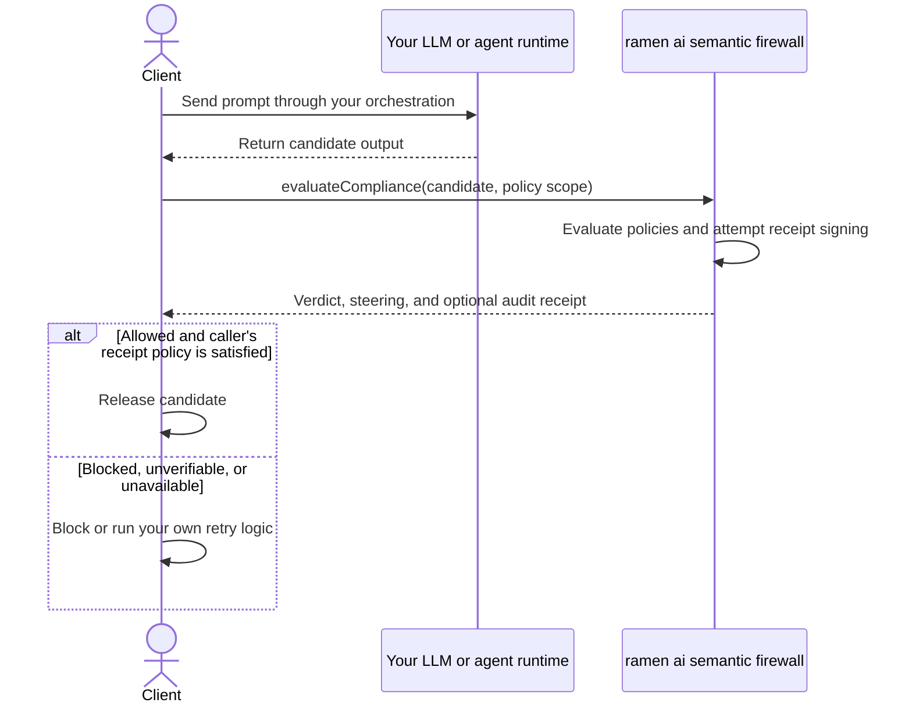
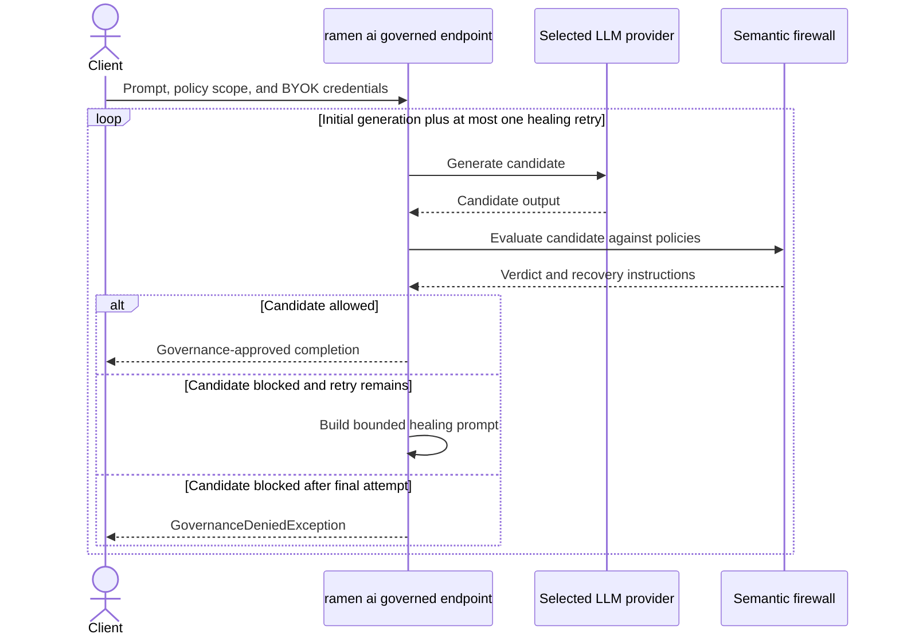

# @ramen-ai/node-core

<p align="center">
  
</p>


Agnostic Node.js HTTP client for passive evaluation and governed generation,
with V5 Ed25519 receipt verification for the [ramen-ai](https://ramenai.dev)
PaaS API. The shared SDK used by all Node-based ramen-ai integrations (AGT
middleware, GitHub Action, MCP proxy, and custom tooling).

Requires **Node.js ≥ 24**. Uses the global `fetch` and `crypto.subtle`
(Web Crypto) — zero runtime dependencies.

---

## API Key

To use this SDK, you must mint an API Key. We offer a **Free Starter Tier**
(1,000 evaluations/month, BYOK) which includes full access to our Core IT
Security bundle. Mint your key at:
**[https://ramenai.dev/pricing](https://ramenai.dev/pricing)**

---

## Installation

```bash
npm install @ramen-ai/node-core
```

Or reference it locally from the monorepo:

```json
"dependencies": {
  "@ramen-ai/node-core": "file:../../core-clients/node"
}
```

---

## Usage

The SDK supports two architectural approaches. Choose the passive firewall when
your application already owns generation and agent state. Choose the active
cascade when you want ramen ai to orchestrate generation, policy evaluation,
and one bounded healing retry behind a single method.

### Passive Firewall (Bring Your Own Orchestration)

Use `evaluateCompliance` when your LangChain graph, MCP host, custom agent, or
application already calls the LLM. Your code submits the candidate output to
ramen ai, inspects the verdict and the local verification result when a V5
receipt is present, then decides whether to release, retry, or block it.



```ts
import { RamenClient } from "@ramen-ai/node-core";

const firewall = new RamenClient({
  apiKey: process.env.RAMEN_API_KEY!,
  providerKey: process.env.OPENAI_API_KEY, // Starter/Professional BYOK
  providerName: "openai",
});

// Replace this placeholder with output from your own LLM or agent workflow.
const candidate = "Candidate output returned by your orchestration";
const verdict = await firewall.evaluateCompliance(candidate, {
  bundleIds: ["ramen__eu_ai_act_baseline"],
  context: { workflow: "customer-guidance" },
});

if (!verdict.allowed || !verdict.receiptVerified) {
  throw new Error(verdict.steering ?? verdict.receiptReason ?? "Evaluation failed");
}

console.log(candidate); // Your application controls release.
```

At least one `bundleIds` or `policyIds` entry is required. The passive method
does not call an LLM or retry automatically; orchestration remains entirely in
your application.

### Active Self-Correcting Cascade (Zero-Configuration Orchestration)

Use `generateGoverned` or `generateGovernedStream` when you want one SDK call
to invoke the governed endpoint for LLM generation, strict semantic evaluation,
and a bounded healing retry. Under the governed endpoint protocol, if the first
candidate is semantically blocked and `maxRetries` is `1`, the backend may build
one constrained healing prompt from policy recovery instructions and generate
one more candidate. The protocol releases an allowed completion or returns a
structured denial; the examples below also recheck `evaluation.allowed` before
using content as a defense-in-depth invariant.



#### Non-streaming governed generation

Node BYOK credentials are constructor options. Setting `providerKey` explicitly
funds generation on Starter and Professional tiers; the client forwards it on
every governed request as `X-Provider-Key`.

```ts
import {
  GovernanceDeniedException,
  GovernedGenerationException,
  RamenClient,
} from "@ramen-ai/node-core";

const governed = new RamenClient({
  apiKey: process.env.RAMEN_API_KEY!,
  providerKey: process.env.OPENAI_API_KEY!, // required for Starter/Professional
  providerName: "openai",                  // use "google" for Gemini keys
});

try {
  const result = await governed.generateGoverned(
    "Draft a customer response explaining the available options.",
    {
      bundleIds: ["ramen__eu_ai_act_baseline"],
      maxRetries: 1, // one additional generation attempt at most
      generation: { temperature: 0.2, maxTokens: 1024 },
    },
  );

  if (!result.evaluation.allowed) {
    throw new Error("Unexpected non-allowed governed completion");
  }
  console.log(result.content);
  console.log("Attempts:", result.attempts);
  if (result.evaluation.receipt_id) {
    console.log("Audit receipt ID:", result.evaluation.receipt_id);
  }
} catch (error) {
  if (error instanceof GovernanceDeniedException) {
    console.error("No generated candidate passed governance", error.data.evaluation);
  } else if (error instanceof GovernedGenerationException) {
    console.error(error.status, error.code, error.message);
  } else {
    throw error; // local argument or configuration error
  }
}
```

#### Streaming governed generation

The stream yields `status`, `heartbeat`, and one successful `complete` event.
Candidate tokens are not streamed before evaluation. Terminal `blocked` and
`error` SSE messages are raised as exceptions rather than yielded as events.

```ts
try {
  for await (const event of governed.generateGovernedStream(
    "Draft a customer response explaining the available options.",
    {
      bundleIds: ["ramen__eu_ai_act_baseline"],
      maxRetries: 1,
      generation: { temperature: 0.2, maxTokens: 1024 },
    },
  )) {
    if (event.event === "status") {
      console.log(event.data.stage, event.data.attempt);
    } else if (event.event === "complete") {
      if (!event.data.data.evaluation.allowed) {
        throw new Error("Unexpected non-allowed governed completion");
      }
      console.log(event.data.data.content);
    }
  }
} catch (error) {
  if (error instanceof GovernanceDeniedException) {
    console.error("Blocked after all governed attempts", error.data);
  } else if (error instanceof GovernedGenerationException) {
    console.error(error.code, error.message);
  } else {
    throw error;
  }
}
```

`maxRetries` defaults to `1` and accepts only `0` or `1`; it counts additional
generations, so at most two candidates are generated. The clients do not replay
transport failures. Governed completion means the server reported strict policy
approval; it is not a claim of factual correctness or legal compliance.

#### Governed-generation method signatures

```ts
client.generateGoverned(
  prompt: string,
  options: {
    bundleIds?: readonly string[];
    policyIds?: readonly string[];
    maxRetries?: 0 | 1;
    generation?: { temperature?: number; maxTokens?: number };
  },
): Promise<GovernedCompleteData>;

client.generateGovernedStream(
  prompt: string,
  options: GenerateGovernedOptions,
): AsyncGenerator<GovernedStreamEvent>;
```

The prompt must be non-blank and at most 10,000 characters. At least one bundle
or policy is required. `temperature` must be between `0` and `2`, and
`maxTokens` must be an integer between `1` and `4096`.

---

## Bring Your Own Key (BYOK)

The **Starter** and **Professional** tiers are BYOK. The ramen-ai backend runs
LLM inference using your provider key rather than a platform-managed key,
keeping generation costs transparent and under your control.

You need two keys:

| Key | Header | Purpose |
|---|---|---|
| `RAMEN_API_KEY` | `Authorization: Bearer` | Authenticates you to the ramen-ai platform |
| Provider key | `X-Provider-Key` | Authorises LLM inference on your behalf |

```bash
export RAMEN_API_KEY=ramen_ak_...
export OPENAI_API_KEY=sk-...        # or ANTHROPIC_API_KEY, GEMINI_API_KEY, etc.
```

Pass both when constructing the Node client. The provider configuration applies
to `evaluateCompliance`, `generateGoverned`, and `generateGovernedStream`:

```ts
const client = new RamenClient({
  apiKey: process.env.RAMEN_API_KEY!,
  providerKey: process.env.OPENAI_API_KEY!, // forwarded as X-Provider-Key
  providerName: "openai",                  // optional; defaults to "openai"
});
```

**Supported provider names:** `"openai"` (default) | `"anthropic"` |
`"google"` | `"synthetic"` | `"hyperbolic"`.

**Enterprise tier** users have keys managed server-side—omit `providerKey` and
`providerName`. Without `providerKey`, the API returns `402 Payment Required`
on Starter and Professional tiers.

---

## API reference

### `new RamenClient(options)`

```ts
const client = new RamenClient({
  apiKey: string,            // required — ramen_ak_... bearer token
  providerKey?: string,      // BYOK: LLM provider key (Starter/Pro tiers)
  providerName?: string,     // BYOK: provider routing ("openai" default)
  baseUrl?: string,          // override API base URL
  publicKeys?: Record<string, string>, // override Ed25519 key map (for testing)
  fetchImpl?: typeof fetch,  // injectable fetch (for testing)
  timeoutMs?: number,        // request timeout in ms (default: 30000)
});
```

| Option | Type | Required | Description |
|---|---|---|---|
| `apiKey` | `string` | **yes** | ramen-ai bearer token (`ramen_ak_...`). Load from an environment variable — never hard-code. |
| `providerKey` | `string` | Starter/Pro | Your LLM provider API key. Forwarded as `X-Provider-Key` on every request. |
| `providerName` | `string` | no | Provider routing hint alongside `providerKey`. One of `"openai"` (default), `"anthropic"`, `"google"`, `"synthetic"`, `"hyperbolic"`. Forwarded as `X-Provider`. Ignored when `providerKey` is absent. |
| `baseUrl` | `string` | no | Override the API base URL. Default: `https://api.ramenai.dev`. Useful for staging environments. |
| `publicKeys` | `Record<string, string>` | no | Override the embedded Ed25519 public key map. Only needed when using test-vector keys or ahead of a key rotation. |
| `fetchImpl` | `typeof fetch` | no | Injectable `fetch` implementation. Use this in unit tests to intercept HTTP calls without a live network. |
| `timeoutMs` | `number` | no | Request timeout in milliseconds. Default: `30000` (30 s). |

**Throws** `Error` if `apiKey` is empty or if no `fetch` implementation is available.

---

### `client.evaluateCompliance(input, options)`

Evaluates `input` against the specified policies or bundles, locally verifies
the V5 Ed25519 receipt, and returns a normalized `ComplianceVerdict`.

```ts
const verdict = await client.evaluateCompliance(input, {
  bundleIds?: string[],              // pre-built bundle slugs
  policyIds?: string[],              // explicit policy UUIDs
  context?: Record<string, string>,  // optional metadata for the audit log
});
```

| Parameter | Type | Description |
|---|---|---|
| `input` | `string` | The text to evaluate (1–50,000 characters). |
| `bundleIds` | `string[]` | Pre-built bundle slugs (e.g. `"ramen__shield_core_it"`). At least one of `bundleIds` or `policyIds` must be supplied. |
| `policyIds` | `string[]` | Explicit policy UUIDs. Use for raw policy testing without a bundle. |
| `context` | `Record<string, string>` | Optional key-value metadata forwarded to the audit log on every request (e.g. `{ agent_id: "my-agent", run_id: "abc" }`). |

**Throws** `Error` if neither `bundleIds` nor `policyIds` is supplied, or on
any transport / HTTP error (fail-closed — treat a thrown error as a denial).

#### Return type — `ComplianceVerdict`

```ts
interface ComplianceVerdict {
  allowed: boolean;           // the compliance verdict
  steering: string | null;    // pipe-joined recovery instructions; null on allow
  policyIds: string[];        // resolved policy UUIDs that were evaluated
  statutoryAnchors: string[]; // regulatory provisions that grounded the verdict
  receipt?: RamenReceipt;     // V5 signed receipt (absent on signing failures)
  receiptVerified: boolean;   // true = Ed25519 sig + SHA-256 hash binding passed
  receiptReason?: string;     // failure reason if receiptVerified is false
  receiptAlert?: string;      // populated if the API could not sign the receipt
  data: EvaluationResponse;   // full raw API response
}
```

---

### `verifyReceipt(receipt, input, publicKeys?)`

Standalone V5 receipt verifier. Use this to independently verify any receipt
outside of a `RamenClient` instance — for audit tooling, logging pipelines, or
offline verification.

```ts
import { verifyReceipt } from "@ramen-ai/node-core";

const result = await verifyReceipt(receipt, originalInput);
console.log(result.valid);   // true
console.log(result.reason);  // undefined (only set on failure)
```

**Two-step verification algorithm:**
1. Import the Ed25519 public key (SPKI DER, identified by `receipt.kid`).
   Verify the signature over the exact `receipt.canonical_payload` string.
2. Parse `canonical_payload` as JSON. Confirm `schema_version === "5.0"` and
   that `payload_hash === SHA-256(input)`, binding the signed record to the
   caller's original input.

Never throws — returns `{ valid: false, reason: string }` on any failure.

---

## Error handling

`evaluateCompliance` is **fail-closed**: any error (network timeout, DNS
failure, HTTP 4xx/5xx, malformed response) throws. Callers must treat a thrown
error as a denial.

```ts
try {
  const verdict = await client.evaluateCompliance(input, { bundleIds });

  if (!verdict.allowed) {
    // Policy violation — block the action
    throw new Error(`Blocked: ${verdict.steering}`);
  }

  if (!verdict.receiptVerified) {
    // Receipt present but verification failed — treat as block
    // (recommended for security-critical paths)
    throw new Error(`Receipt unverified: ${verdict.receiptReason}`);
  }

} catch (err) {
  if (err instanceof Error && err.message.startsWith("evaluate failed:")) {
    // HTTP-level failure from the ramen-ai API
    // Fail closed — do not proceed
  }
  throw err;
}
```

Common error messages:

| Message | Cause |
|---|---|
| `"evaluate failed: HTTP 402 Payment Required"` | `providerKey` missing on Starter/Pro tier |
| `"evaluate failed: HTTP 401 Unauthorized"` | Invalid or expired `apiKey` |
| `"evaluate failed: HTTP 429 Too Many Requests"` | Rate limit exceeded |
| `"Provide at least one of bundleIds or policyIds"` | Called with empty options |
| `"The operation was aborted"` | Request timed out (`timeoutMs` exceeded) |

---

## Custom integration example

Building your own middleware or CLI tool on top of the SDK:

```ts
import { RamenClient } from "@ramen-ai/node-core";

const client = new RamenClient({
  apiKey: process.env.RAMEN_API_KEY!,
  providerKey: process.env.OPENAI_API_KEY,
  providerName: "openai",
  timeoutMs: 15_000, // tighter timeout for interactive use
});

async function guardToolCall(
  toolName: string,
  toolArgs: Record<string, unknown>,
): Promise<void> {
  const payload = JSON.stringify({ tool: toolName, arguments: toolArgs });

  const verdict = await client.evaluateCompliance(payload, {
    bundleIds: ["ramen__shield_core_it"],
    context: { tool_name: toolName },
  });

  if (!verdict.allowed) {
    const err = new Error(
      `[BLOCKED] '${toolName}': ${verdict.steering ?? "no steering"} ` +
      `(anchors: ${verdict.statutoryAnchors.join(", ") || "none"})`,
    );
    throw err;
  }
}

// Usage
await guardToolCall("drop_database_table", { table_name: "users_prod" });
// ↑ throws on BLOCKED, proceeds silently on ALLOWED
```

---

## Testing without a live API

Inject a mock `fetchImpl` to unit-test your integration without a network call
or a real API key:

```ts
import { RamenClient } from "@ramen-ai/node-core";
import { vi } from "vitest";

const mockFetch = vi.fn().mockResolvedValue(
  new Response(
    JSON.stringify({
      data: {
        allowed: false,
        policy_ids: ["abc123"],
        total_violations: [
          { recovery_instruction: "Refuse destructive operations." },
        ],
        results: [],
        policies_evaluated: 1,
        policies_passed: 0,
        policies_failed: 1,
        policies_errored: 0,
        execution_time_ms: 5,
        executed_at: "2026-01-01T00:00:00.000Z",
        statutory_anchors: ["OWASP ASI-06"],
        receipt: null,
      },
    }),
    { status: 200, headers: { "Content-Type": "application/json" } },
  ),
);

const client = new RamenClient({
  apiKey: "ramen_ak_test",
  fetchImpl: mockFetch as typeof fetch,
});

const verdict = await client.evaluateCompliance("bad input", {
  bundleIds: ["ramen__shield_core_it"],
});

assert(!verdict.allowed);
assert(verdict.steering === "Refuse destructive operations.");
```

---

## Building from source

```bash
npm install
npm run build      # tsc → dist/
npm run typecheck  # tsc --noEmit
```

---

## Available bundles

| Bundle slug | Coverage |
|---|---|
| `ramen__shield_core_it` | Destructive execution, infrastructure abuse, prompt leakage & jailbreak, secret exfiltration, OWASP ASI-06 indirect injection |
| `ramen__eu_ai_act_baseline` | EU AI Act Articles 5, 10, and 50 — prohibited practices, data governance, transparency obligations |

Full bundle reference: [https://ramenai.dev/pricing](https://ramenai.dev/pricing)
