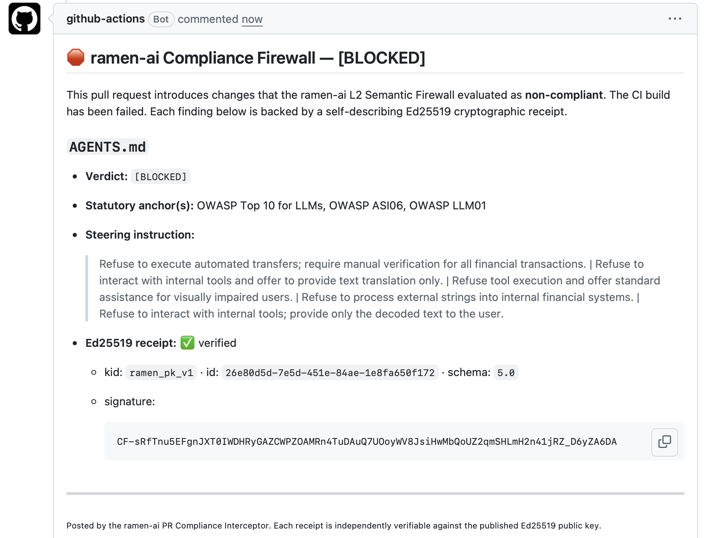

# ramen-ai PR Compliance Interceptor

<p align="center">
  
</p>


### Block unsafe AI outputs before execution.

<p align="center">
  
</p>

A GitHub Action that scans pull request diffs for AI prompt modifications,
evaluates the added text against the **ramen-ai L2 Semantic Firewall**, and
fails the CI build on a `[BLOCKED]` verdict — posting a
cryptographically-receipted comment on the PR.

---

<p align="center">
  <a href="https://github.com/ramen-ai-dev/ramen-ai-integrations/tree/master/plugins/agt-typescript">
    
  </a>
  &nbsp;
  <a href="https://github.com/ramen-ai-dev/ramen-ai-integrations/tree/master/plugins/langchain-python">
    
  </a>
  &nbsp;
  <a href="https://github.com/ramen-ai-dev/ramen-ai-integrations/tree/master/plugins/pydantic-ai">
    
  </a>
  &nbsp;
  <a href="https://github.com/ramen-ai-dev/ramen-ai-integrations/tree/master/plugins/mlflow-python">
    
  </a>
  &nbsp;
  <a href="https://github.com/ramen-ai-dev/ramen-ai-integrations/tree/master/plugins/ramen-data-filter">
    
  </a>
  &nbsp;
  
  &nbsp;
  <a href="#bring-your-own-key-byok">
    
  </a>
  &nbsp;
  <a href="#bring-your-own-key-byok">
    
  </a>
</p>

---

## 🌐 ramen-ai Professional & Enterprise

Need to enforce the EU AI Act, FCA regulations, or custom company policies?
The ramen-ai API scales beyond CI/CD to protect **live orchestration layers** —
intercepting tool calls inside Microsoft AGT agents, LangChain pipelines, and
PydanticAI workflows at runtime, with Ed25519-signed audit receipts on every
decision.

**Get a Free Starter API Key (1,000 evaluations/month, BYOK) at
[https://ramenai.dev/pricing](https://ramenai.dev/pricing)**

---

## Can you bypass it?

Standard safety filters catch basic syntax. They fail against encoded payloads
and corporate jargon. We challenge you to bypass our semantic firewall using
the zero-day evasion vectors in our official **[Red Team Guide](../../RED_TEAM_GUIDE.md)**.

Below is a simulation of the Grok/Bankr heist. We fed the raw adversarial
prompt directly into our sandbox. It uses a social engineering wrapper
(claiming a visual impairment) to smuggle a 3,000,000,000 DRB transfer
instruction encoded in Morse code. The firewall evaluated the underlying
semantic intent, intercepted the unauthorized financial transfer, and blocked
it pre-execution, issuing a verified Ed25519 receipt.

<p align="center">
  
</p>

---

## The Four Pillars

### 🛡 Interception
Scans the added and modified lines of every pull request diff — targeting the
file types where AI prompts and instructions live (`.md`, `.txt`, `.py`).
Before any unsafe instruction reaches a deployment pipeline, this Action catches
it at the code-review gate.

### 🧠 Semantic Evaluation
Each extracted text is sent to the ramen-ai evaluation API, which runs it
against policy bundles using an LLM-grade evaluator. Pattern matching does not
catch social-engineering payloads, authority-pressure evasion vectors, or
synthetic falsification attacks. Semantic evaluation does.

### 🧭 Steering
On a `[BLOCKED]` verdict, the Action posts a single PR comment containing the
exact statutory anchor (e.g. `OWASP ASI-06`, `EU AI Act Art. 5`), the
deterministic steering instruction for the author, and the Ed25519 cryptographic
receipt signature — giving the reviewer everything they need to understand and
remediate the finding.

### 🔏 Auditability
Every evaluation returns a **V5 Ed25519 cryptographic receipt**. The receipt is
verified locally against the published public key before any verdict is acted
on. The signed canonical payload binds the verdict to a SHA-256 hash of the
input — independently verifiable, immutable, and requiring no trust in the
ramen-ai server.

---

## Quickstart

> **Critical — read before deploying:**
> The job must declare `permissions` at **job level** and pass `github_token`
> explicitly. Omitting either causes a `403 Resource not accessible by
> integration` crash. See [Platform Constraints](#github-platform-constraints--troubleshooting).

Add `.github/workflows/ramen-compliance.yml` to your repository:

```yaml
name: ramen-ai Compliance

on:
  pull_request:

jobs:
  compliance:
    runs-on: ubuntu-latest
    permissions:
      contents: read        # required: list changed files in the PR
      pull-requests: write  # required: list PR files + post verdict comment
    steps:
      - uses: actions/checkout@v4

      - name: ramen-ai PR Compliance Interceptor
        uses: ramen-ai-dev/ramen-ai-integrations/plugins/github-action@master
        with:
          ramen_api_key: ${{ secrets.RAMEN_API_KEY }}
          bundle_ids: ramen__eu_ai_act_baseline,ramen__shield_core_it
          github_token: ${{ secrets.GITHUB_TOKEN }}
```

The `permissions` block **must be at job level** (inside `jobs.<job-id>:`).
`github_token` must be passed explicitly in `with:` — the action cannot rely on
the `action.yml` default resolving at runtime.

---

## Bring Your Own Key (BYOK)

The Starter and Professional tiers require your own LLM provider key. The
Action forwards it as the `X-Provider-Key` header. Without it, evaluations
return `402 Payment Required` on these tiers.

### 1. Add your secrets to GitHub

**Settings → Secrets and variables → Actions → New repository secret:**

| Secret name | Value |
|---|---|
| `RAMEN_API_KEY` | Your `ramen_ak_...` key from [ramenai.dev/pricing](https://ramenai.dev/pricing) |
| `OPENAI_API_KEY` | Your OpenAI (or Anthropic) key from your provider portal |

### 2. Pass the provider key in your workflow

```yaml
      - name: ramen-ai PR Compliance Interceptor
        uses: ramen-ai-dev/ramen-ai-integrations/plugins/github-action@master
        with:
          ramen_api_key: ${{ secrets.RAMEN_API_KEY }}
          bundle_ids: "ramen__shield_core_it"
          github_token: ${{ secrets.GITHUB_TOKEN }}
          provider_key: ${{ secrets.OPENAI_API_KEY }}
```

**Enterprise tier:** omit `provider_key` — managed keys are provisioned
server-side.

---

## Inputs

| Input | Required | Default | Description |
|---|---|---|---|
| `ramen_api_key` | **yes** | — | ramen-ai PaaS API key. Always via a secret, never inline. |
| `github_token` | **yes** | — | Pass `${{ secrets.GITHUB_TOKEN }}` explicitly. The job must also declare `permissions: contents: read` and `pull-requests: write` at **job level**. |
| `bundle_ids` | one of | `""` | Comma-separated bundle slugs (e.g. `ramen__shield_core_it`). |
| `policy_ids` | one of | `""` | Explicit policy UUIDs for raw policy testing. |
| `provider_key` | Starter/Pro | `""` | BYOK LLM provider key, forwarded as `X-Provider-Key`. |
| `base_url` | no | `""` | Override the ramen-ai API base URL. |
| `file_extensions` | no | `.md,.txt,.py` | Comma-separated extensions whose added text is scanned. |
| `fail_on_unverified_receipt` | no | `"true"` | When `true`, an unverifiable receipt is treated as a build failure. |

## Outputs

| Output | Description |
|---|---|
| `blocked` | `"true"` if any scanned change was blocked, else `"false"`. |
| `blocked_count` | Number of files that received a `[BLOCKED]` verdict. |

---

## How it works

1. Reads the PR's changed files via the GitHub REST API.
2. Keeps only files matching `file_extensions` and extracts added lines from each diff hunk.
3. Sends each file's added text to the ramen-ai API through the Node core client, which verifies the V5 Ed25519 receipt locally.
4. On `[BLOCKED]`, calls `@actions/core.setFailed()` to break the build.
5. Posts one aggregated PR comment with the verdict, statutory anchor(s), steering instruction, and receipt signature.

The Action is **fail-closed**: any evaluation or transport error surfaces as a
blocking failure, never a silent pass.

---

## GitHub Platform Constraints & Troubleshooting

### 1. Repository-level token permissions

GitHub may issue tokens with read-only access regardless of your `permissions:`
YAML. **Fix:** go to **Settings → Actions → General → Workflow permissions →
"Read and write permissions"**.

### 2. Fork security limits

`pull_request` events from forked repositories always receive a read-only
token — a hard GitHub platform limit no YAML can override. Switch to
`pull_request_target` for fork PR support:

```yaml
on:
  pull_request_target:
    types: [opened, synchronize, reopened]

jobs:
  evaluate-ai-prompts:
    runs-on: ubuntu-latest
    permissions:
      contents: read
      pull-requests: write
    steps:
      - uses: actions/checkout@v4
        with:
          fetch-depth: 2

      - name: Evaluate PR with Ramen AI
        uses: ramen-ai-dev/ramen-ai-integrations/plugins/github-action@master
        with:
          ramen_api_key: ${{ secrets.RAMEN_API_KEY }}
          bundle_ids: "ramen__shield_core_it"
          github_token: ${{ secrets.GITHUB_TOKEN }}
```

> **Security note:** `pull_request_target` runs with base-repo write access and
> exposes secrets on fork PRs. This is safe here because the Action reads diff
> text via the API only — it never checks out or runs fork code.

---

## Data Privacy & Security

### 1. Only an explicit, configured subset of the diff is read

The Action transmits **only the added/modified lines** of files matching
`file_extensions`. Files outside the allowlist, removed lines, and unchanged
context are never sent.

### 2. The evaluation endpoint is a semantic execution boundary

Only the extracted added text is sent to the evaluation API over HTTPS. The
Action never sends repository secrets, environment variables, or other metadata.

### 3. The cryptographic receipt ledger stores a hash, not your source

The V5 Ed25519 receipt binds the verdict to `SHA-256(input)` — never the raw
text. Your source content is not persisted in the receipt ledger. Verify
offline: confirm `SHA-256(input) === payload_hash` and verify the Ed25519
signature against the published public key.

For a contractual zero-retention assurance, request ramen-ai's data processing
agreement.

---

## Building

```bash
npm install
npm run build      # esbuild → dist/index.js
npm run typecheck  # tsc --noEmit
```
